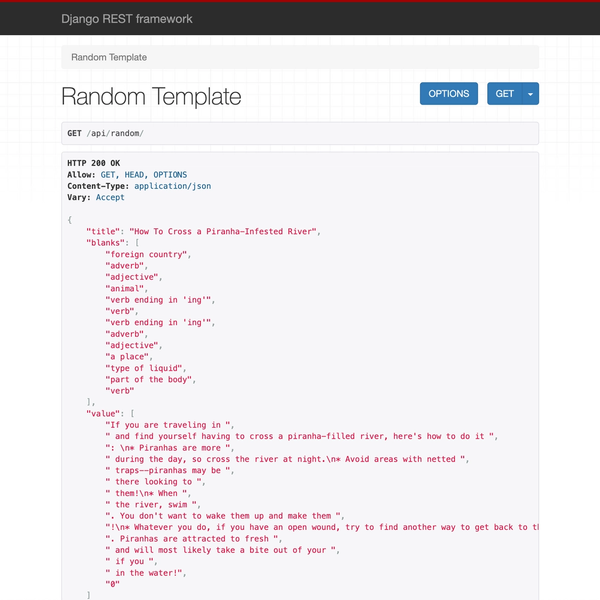

# Madlibs API

A Madlibs game application and REST API built with Django. This application lets the user generate a funny story by filling in the blanks. This full-stack application also doubles as a REST API that can be used with other applications.

[https://madlibs-api.fly.dev](https://madlibs-api.fly.dev)

## Technologies
- Python
- Django
- Fly.io
- CSS3
- HTML5
- JQuery
- JavaScript
- Vite.js

## Image
