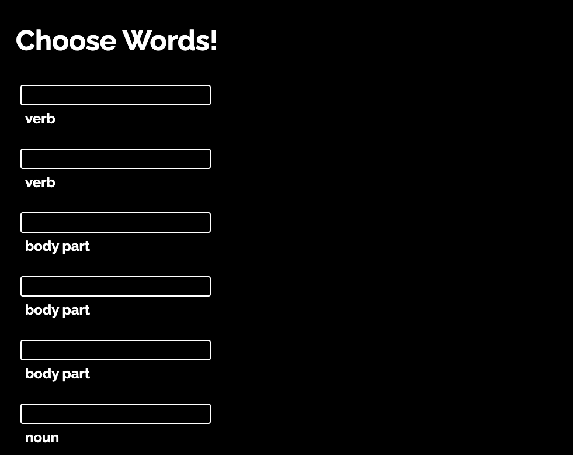

# MadLibz
Frontend for a Madlibs game app. The user is promted to choose random words to generate a funny story!
This app is built with with HTML, CSS and JavaScript.

- [https://madlibz-rldev.netlify.app/](https://madlibz-rldev.netlify.app/)

## Technologies
- JQuery
- JavaScript
- Vite.js
- HTML5
- CSS3
- Netlify

## Image

